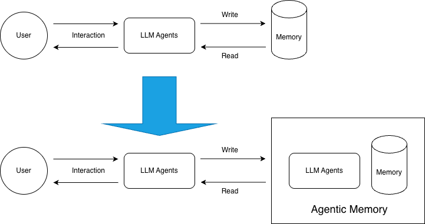
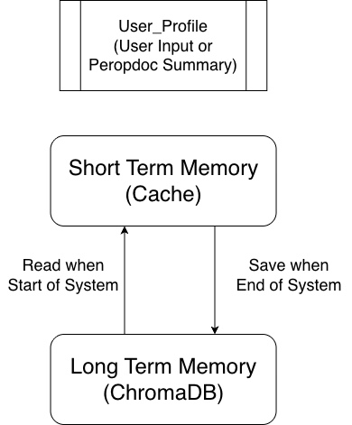

Here is the English version of the README.md file, tailored for your GitHub repository. It incorporates the content from your Master's thesis and places the images logically to explain the system architecture.

## MLA-ARC: A Multi-Layered Agentic Memory ArchitectureIntegrating Dynamic Memory Evolution via Prompt Engineering
2025 Master Thesis Project | Waseda University

## 📖 Introduction

**MLA-ARC** (Multi-Layered Agentic Architecture) is a novel **dynamic memory system for LLM Agents** inspired by human cognitive psychology.

Traditional Retrieval-Augmented Generation (RAG) systems typically adopt a static "Append-only" storage strategy. This approach often leads to "memory homogenization," retrieval noise interference, and unbounded storage expansion during long-term interactions.

MLA-ARC addresses these limitations by introducing a **three-tier memory architecture** (User Profile, Short-Term Memory, Long-Term Memory) and a **dynamic evolution mechanism** based on Prompt Engineering. This system allows the agent not just to store data, but to perform real-time correction, fusion, and active forgetting, creating a cognitive system with "metabolic" capabilities.



Figure 1: Comparison between Traditional RAG Memory Systems and the MLA-ARC System

## 🎯 Key Challenges Solved
This project aims to resolve three core bottlenecks in building Long-Term LLM Agents:
1. **Statelessness & Context Limitations**: Overcomes the "amnesia" of standard LLMs and the high cost/latency of extremely long context windows.
2. **Static Nature vs. Dynamic Reality**: Solves the issue where traditional RAG cannot handle changing information (e.g., user preference shifts), preventing logical conflicts and hallucinations caused by outdated data.
3. **Storage Bloat**: Introduces an "Active Forgetting" mechanism to automatically compress and prune low-value memories, maintaining high retrieval signal-to-noise ratio.

## 🏗️ System Architecture
The core workflow of MLA-ARC consists of four phases: **Memory Construction** -> **Save & Select** -> **Memory Evolution** -> **Memory Retrieval**.




Figure 2: Overview of the MLA-ARC System Workflow

### 1. Three-Layered Memory Structure
To simulate human memory models, the system discards flat indexing in favor of a hierarchical design:

* **User Profile (UP)**: The top layer acting as "metadata." It stores global, static, or semi-static user attributes (e.g., name, occupation, core constraints) extracted from dialogues to ensure persona consistency.
* **Short-Term Memory (STM)**: Simulates "Working Memory." It uses a **Cache Queue** structure to retain the exact raw text of the most recent $K$ turns, ensuring the fluidity of the immediate conversation.
* **Long-Term Memory (LTM)**: Built on **ChromaDB**. It stores historical experiences that have been summarized, de-noised, and structured into "Memory Nodes" for complex semantic retrieval.


Figure 3: The Three-Layer Architecture: User Profile, STM, and LTM.

### 2\. Dynamic Memory Evolution
This is the core innovation of MLA-ARC. Instead of simply appending new data, the system uses **Prompt Chains** to interact with existing memories:

* **Reinforcement**: If new information matches old memory, it increases the confidence or access count of the existing node.
* **Correction & Update**: If new information conflicts with old facts (e.g., "I moved to Osaka"), the system updates or marks the old node as outdated to resolve conflicts.
* **Link Generation**: Automatically identifies semantic connections between discrete memory nodes, creating a knowledge graph that supports **Multi-hop Reasoning**.

### 3. Eviction & Consolidation Mechanism
To prevent unbounded growth, the system implements a lifecycle management algorithm based on **Access Frequency** and **Time Decay**.

When the LTM storage or STM token count exceeds a preset threshold:
1. **Identification**: The system selects the "coldest" memory fragments (lowest temperature).
2. **Consolidation**: An LLM-driven Summary Prompt fuses these fragmented details into a high-density "Archived Node".
3. **Eviction**: The original raw fragments are physically deleted, achieving lossy compression.


Figure 4: The Memory Compression and Eviction Lifecycle

## 🛠️ Tech Stack
* **Language**: Python 3.10+ 
* **Agent Orchestration**: LangChain
* **Vector Database**: ChromaDB (Vector + Metadata storage) 
* **LLM Backbone**: Supports OpenAI (GPT-4o/mini) and Local Models (via Ollama/LiteLLM, e.g., Llama 3, Qwen) 
* **Embedding**: sentence-transformers/all-MiniLM-L6-v2

## 🚀 Quick Start
### Prerequisites
```bash
# Clone the repository
git clone https://github.com/YourUsername/MLA-ARC.git
cd MLA-ARC

# Install dependencies
pip install -r requirements.txt
```
### See README_QUICKSTART.md
Then please read README_QUICKSTART.md, follow the guidance to do the smallest example.

### Configuration
Create a .env file in the root directory:
```
OPENAI_API_KEY=sk-xxxx
# if use ChromaDB
CHROMA_DB_PATH=./chroma_db
```

## 📊 Performance
Evaluated on the **LoCoMo** (Long-term Context) and **DialSim** (Social Simulation) datasets, MLA-ARC demonstrated significant improvements over baselines like MemoryBank, ReadAgent, and MemGPT:

* **Multi-hop Reasoning**: F1 Score improved by approximately **100-200%** compared to baselines on complex dependency tasks.
* **Storage Efficiency**: Token consumption reduced by **85-93%** through the structured indexing and compression mechanisms.
* **Scalability**: Maintained low latency retrieval (~3.7ms) even with a memory scale of 1,000,000 nodes.
